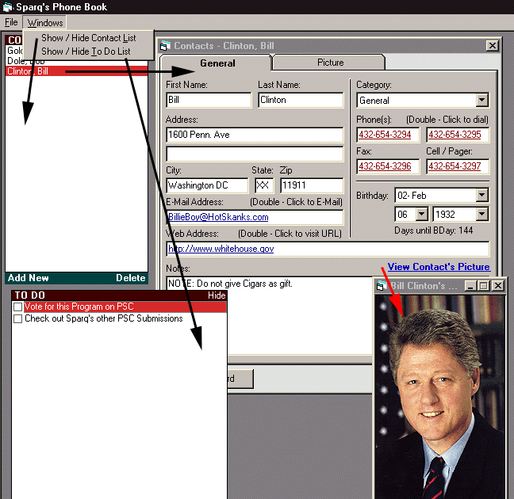



## Personal Contact Manager v4\.0 \- PLEASE VOTE\.\.\. MANY FEATURES ADDED

### Description

If you've downloaded previous versions, you'll know the genral basis here. This program will allow you to Manage your contacts' Address, Phone Number(s), Email Address, URL, Brithday (Now with 2-Week-Prior Reminder). Automatically Dial Numbers, visit URL, or Write an Email with the click of a button
 
### More Info
 

             |
---                |---
**Submitted On**   |2000-09-19 13:26:20
**By**             |[Sparq](https://github.com/Planet-Source-Code/PSCIndex/blob/master/ByAuthor/sparq.md)
**Level**          |Intermediate
**User Rating**    |4.3 (17 globes from 4 users)
**Compatibility**  |VB 6\.0
**Category**       |[Complete Applications](https://github.com/Planet-Source-Code/PSCIndex/blob/master/ByCategory/complete-applications__1-27.md)
**World**          |[Visual Basic](https://github.com/Planet-Source-Code/PSCIndex/blob/master/ByWorld/visual-basic.md)
**Archive File**   |[CODE\_UPLOAD99869192000\.zip](https://github.com/Planet-Source-Code/sparq-personal-contact-manager-v4-0-please-vote-many-features-added__1-11549/archive/master.zip)

